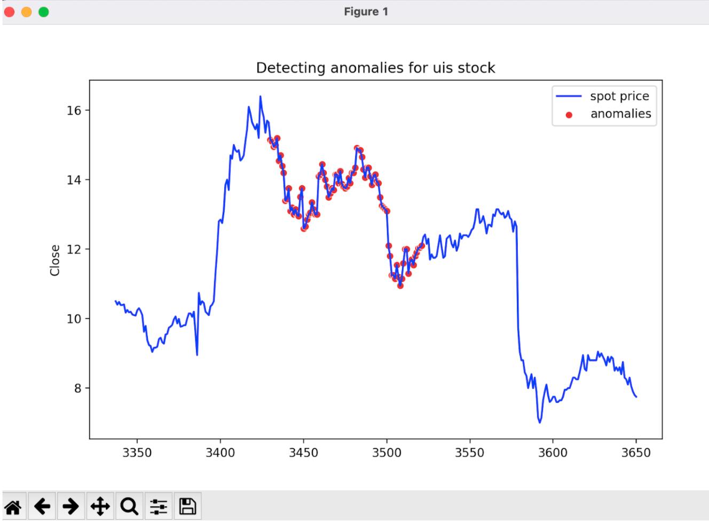
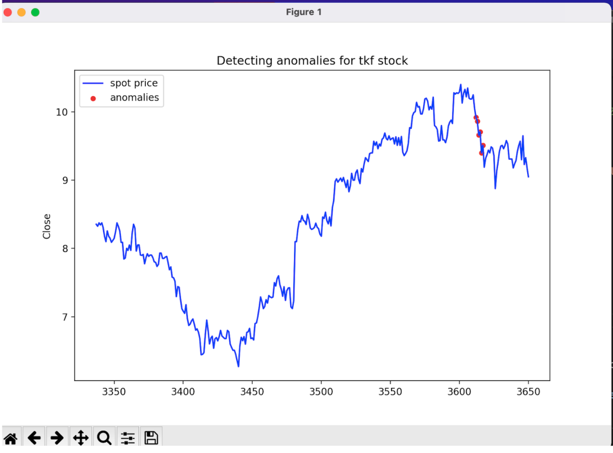

### A Deep Learning project that I implemented for *Software Development for Algorithmic Problems* course.

## Project Description
This is a Deep Learning project that uses **Keras API** . Forecast and Anomaly Detection projects implemented using LSTM Neural Networks after a lot of experiments for choosing hyperparameters.

## Forecasting
First the user has to specify the arguments of this program in order to work properly. 
To run the forecast program try:
```
python3 forecast.py -d [dataset_name] -n [n_time_series] 
```
Once the user specifies the dataset and the number of time series to be forecasted, the program starts creating the training and test sets in a split of 80-20 . Firstly the program selects 80% of all the time series that are given for training the model and randomly picks a time series from the dataset and tries to predict its future values. Then the program, tries to make a model that is based on this random chosen time series and then tries to predict its values.In this sigle time-series model, the split is done using the 80% of this specific time series as training data and the other 20% as prediction validation data.


*The following image is an image of a stock that predicted from a model that trained in a dataset of 360 time series that used the 80% of them for creating the model.*
<p align="center"> 
 
</p>


*The following image is an image of a stock that predicted from a model that trained in the values of this time series using the 80% of it's values for train and the other 20% for the validation set*

<p align="center"> 
 
</p>


As you can see both the models are accurate to the values of the time series that used to be predicted.


## Anomaly Detection

To run the anomaly detection program try:
```
python3 anomaly-detection.py [dataset_name] -n [n_time_series] -mae [error]
```

Once the user specifies the dataset, the number of time series to be analysed for anomaly detection and the threshold  (error) value, the program starts creating the training and test sets in a split of 80-20 . The program selects 80% of all the time series that are given for training the model and randomly picks a time series from the dataset and tries to do the anomaly detection. 


*The following image is an image of a stock, with a specific threshold, that predicted from a model that trained in a dataset of 360 time series that used the 80% of them for creating the model.*
<p align="center"> 
 
</p>


*The following image is an image of a stock, with a specific threshold,  that predicted from a model that trained in the values of this time series using the 80% of it's values for train and the other 20% for the validation set*

<p align="center"> 
 
</p>


As you can see both the models are accurate to the values of the time series that used to be predicted.


